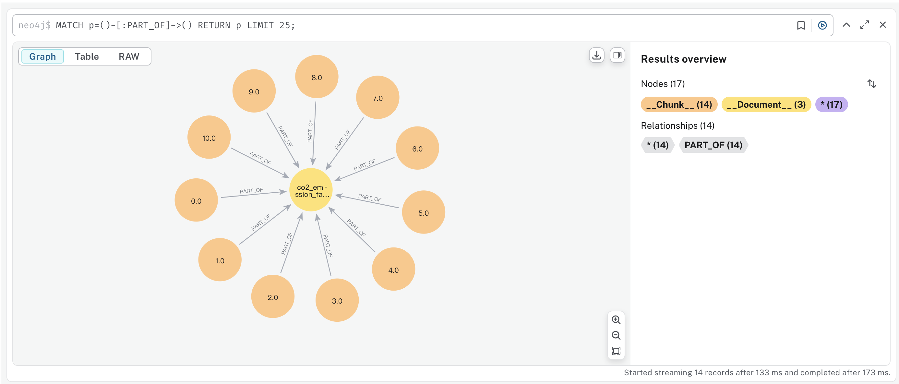
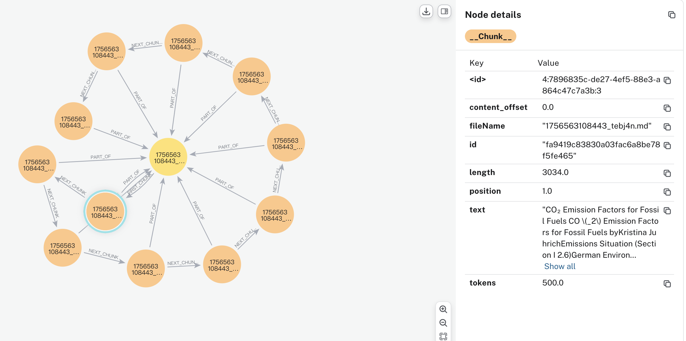
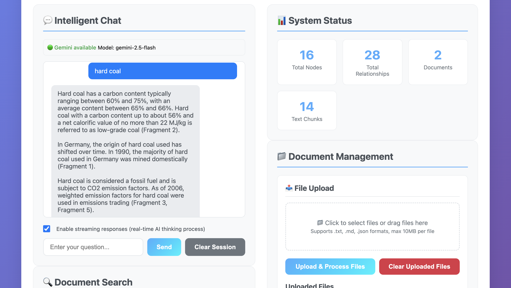
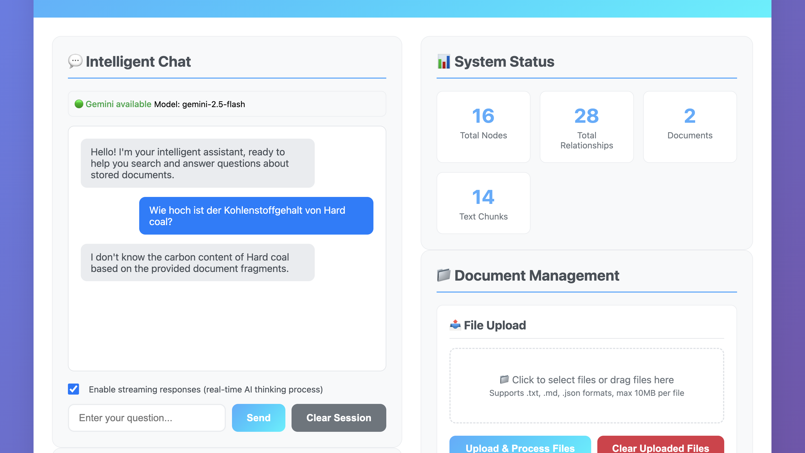
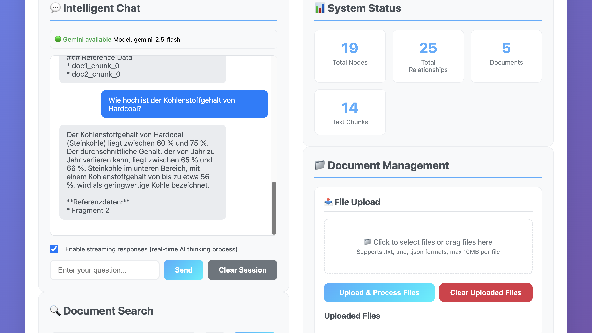
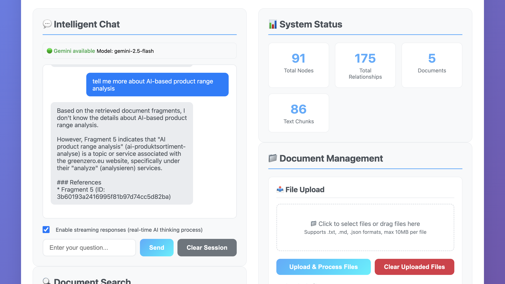
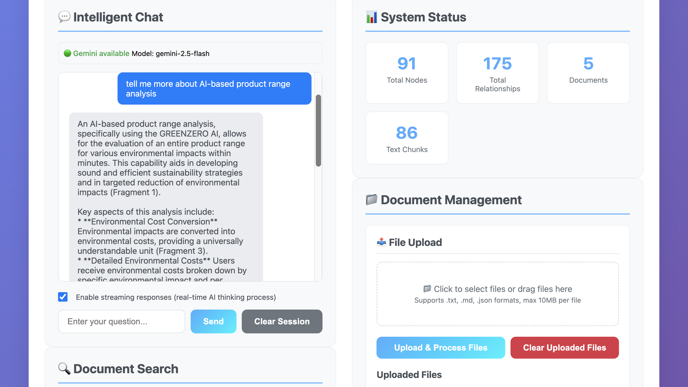
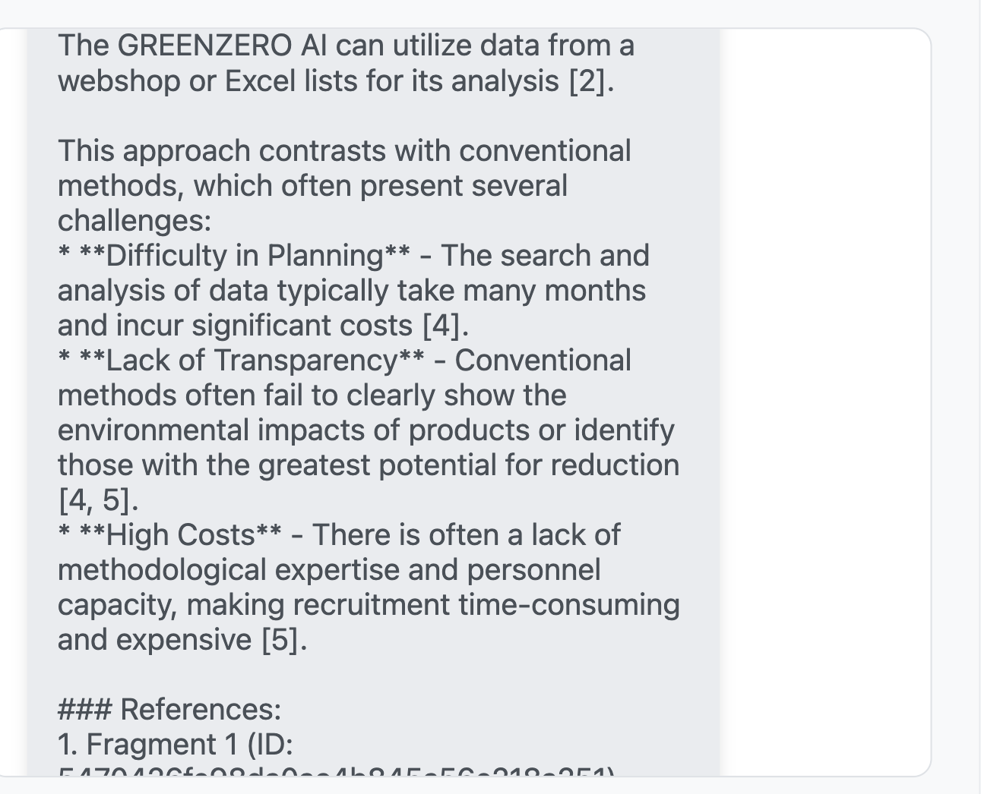

# Intelligent Knowledge Graph Agent System

This project is an advanced agent system that organically combines document processing, knowledge graph construction, and AI-driven search capabilities. Built on the **Neo4j** graph database and modern AI services, the system is designed to extract, organize, and deliver deep insights from unstructured data.

## ✨ Core Features

-   **📄 Intelligent Document Processing**: Supports various formats (TXT, MD, etc., easily expandable to PDF by integrating tools like minerU) and offers configurable intelligent parsing and chunking strategies.
-   **🧠 Knowledge Graph Construction**: Automatically extracts entities and relationships from processed documents to build a knowledge graph. (Currently implements a graph structure of Chunks and Documents; the next step is to extract entity relationships using an LLM).
-   **🔍 AI-Driven Hybrid Search**: Fuses semantic vector search with keyword search to provide more accurate, in-depth query results, and supports cross-lingual retrieval.
-   **🤖 Intelligent Agent**: A built-in, configurable AI agent responsible for understanding user queries, processing requests, and generating high-quality answers.
-   **🌐 Full-Featured REST API**: Provides comprehensive API endpoints for easy integration with front-end applications or other services.
-   **💬 Conversation Management**: Supports persistent chat sessions for a seamless user interaction experience.

## 🏗️ System Architecture

The system uses a modular design with clear, distinct layers, making it easy to extend and maintain.

`[Client/Frontend] -> [🌐 API Layer (Express.js)] -> [🤖 Agent & Services Layer] -> [🔎 Search Layer] -> [💾 Database Layer (Neo4j)]`

-   **Services Layer**: Handles core business logic, including document processing, graph construction, and AI service integration.
-   **Agents Layer**: Intelligent agents responsible for query processing, decision-making, and response generation.
-   **Database Layer**: Deeply integrated with Neo4j for efficient graph operations.
-   **Search Layer**: Implements hybrid search algorithms and result ranking.
-   **API Layer**: Exposes RESTful interfaces based on Express.js.


## The Journey: From RAG to GraphRAG

### Project Genesis

Upon receiving this open-ended assignment, I considered several approaches:
1.  Building a multi-node, stateful agent with retry mechanisms and tool conditions using LangGraph to automate the most time-consuming phase of a Life Cycle Assessment (LCA).
2.  Creating a scalable self-service agent to help clients quickly assess the environmental impact of their entire product portfolio by integrating with their ERP system data.

However, both concepts were heavily dependent on specific business data (like Bill of Materials, process flows, ERP data) that I did not have access to. I ultimately realized that implementing a **GraphRAG** system could provide a solid data foundation and powerful analytical tools for all the above scenarios. For instance, after obtaining hotspot analysis results from an LCA, GraphRAG could provide experts with data-driven, innovative, and actionable emission reduction measures. It could serve as a constantly updated proprietary knowledge base, acting as a critical information node in a multi-agent system.

Therefore, I decided to build a GraphRAG system. Within the limited time, I focused on architectural planning and optimization design (e.g., graph structure, chunking strategy, search implementation), while leveraging Cursor AI to efficiently fill in the boilerplate code and accelerate prototype development.

### Phase 1: Building a RAG Framework with a Graph Structure

In the initial phase, we built the core framework of the system, giving it the basic functionalities of RAG and the structure of a graph database.


Initial Database Structure 

-   **Core Implementation**:
    -   Established a modular project structure (`src/agents`, `src/database`, `src/search`, etc.).
    -   Implemented document chunking and processing.
    -   Built a basic `Document -> Chunk` graph structure in Neo4j.
    -   To facilitate context retrieval, we added a unique hash ID to Chunk nodes and created a `NEXT_CHUNK` relationship to link adjacent chunks.


Evolved from the Initial Database Structure

-   Implemented an initial search function based on keyword matching.

-   **Milestone**:
    -   A simple front-end page was developed that could successfully query and return text chunks based on keywords.



*Note: The example documents in the database are located in the document folder, converted from PDF using the minerU open-source PDF parser. This workflow can easily be integrated to directly process PDF documents.*

-   **The Bottleneck: Text-Only Matching**
    -   The initial search implementation relied on Cypher's `CONTAINS` clause, which led to several issues:
        -   ❌ **Cannot handle semantic similarity**: It could only find exact keyword matches.
        -   ❌ **Lacks contextual understanding**: Missed valuable content that used different vocabulary but was contextually relevant.
        -   ❌ **Language barriers**: Could not perform cross-lingual searches. For example, a query in German could not find relevant content in an English document.




---

In the first phase of the project, we successfully built a complete, end-to-end system prototype, which laid a solid foundation for all subsequent feature iterations.

The key achievement of this version was the construction of the system's core skeleton, including a modular backend architecture, a full REST API layer using Express.js, and seamless integration with the Neo4j graph database. Functionally, the system implemented automated document chunking and processing, successfully creating a foundational `Document -> Chunk` graph structure within the database. Furthermore, a keyword-based search function was deployed and operational, validating the viability of the entire data processing and query pipeline.

This initial version not only proved the soundness of the overall architecture but, more importantly, its practical implementation clearly exposed the limitations of a text-only search. This provided a clear objective and the necessary motivation for Phase 2: introducing vector indexing to achieve true semantic understanding.

### Phase 2: Integrating Vector Index for Intelligent Search

To overcome the limitations of text-only search, the core task of the second phase was to integrate vector embeddings and vector search.

-   **Major Updates**:
    1.  **Embedding Integration**: In the document processing pipeline, we used Google's Embedding model to generate vector representations for each chunk and stored them in the database.
    2.  **Upgraded Search Logic**: The search flow was upgraded from a single keyword match to a hybrid model of "vector search + keyword search," complete with a strategy for merging and ranking results.
    3.  **Optimized Chunking Strategy**: To ensure contextual continuity, we introduced an overlap mechanism and split chunks at sentence boundaries (determined by punctuation like `.`, `!`, `?`), effectively preventing key information from being fragmented.

#### **Ensuring Contextual Continuity**

#### **Why is Overlap/Chunking Contextual Continuity Necessary?**

Imagine a search for the term "West Germany University." Without overlap, the text could be split right in the middle of the name:

- **Chunk 1:** ...some text ending with West Germany
- **Chunk 2:** University is a school located...

A search for the full name might fail because it doesn't exist completely in either chunk.

#### **How Overlap and `NEXT_CHUNK` Solves This**

With overlap and find all end-of-sentence punctuation marks like 。, ！, and ？. These symbols reliably indicate the end of a complete thought. And the second chunk begins with part of the end of the first chunk.

- **Chunk 1:** ...some text ending with East China University.
- **Chunk 2:** East China University is a school located...

Now, the full term exists in both chunks, making search and semantic analysis far more reliable.

- **User Experience**: More relevant and coherent search results
- Search Accuracy: +20% improvement in semantic search results
- Context Quality: Complete sentences instead of fragments

-   **Results and Improvements**:
    -   **Cross-Lingual Semantic Search**: After the upgrade, the system could easily understand semantic similarity across different languages and return relevant results.



-   **Enhanced Contextual Awareness**: Thanks to the optimized `NEXT_CHUNK`  relationship and chunking strategy, the system now provides much richer context with its search results.
        -   *Result without context*: Only isolated text fragments were visible.



-   *Result with adjacent context via `NEXT` relationship*: The system could display context directly related to the result, providing more complete information.





> **Disclaimer**: This version focused on the rapid implementation and validation of core features. Consequently, aspects like code stability, consistency maintenance, and comprehensive testing were not prioritized. In a real-world development environment, these would be my primary concerns.

## 🚀 Next Steps: Achieving True GraphRAG

The current system is a functional RAG with a graph structure. The next step is to introduce an LLM for entity and relationship extraction, completing the evolution into a true **GraphRAG**.

1.  **LLM-Powered Structured Extraction**: Utilize a Large Language Model to automatically identify predefined entities and relationships from text chunks and store them structurally in Neo4j.Customize by ours needs, like a Client Company Information:
    -   **Entity Types**: `person`, `technology`, `mission`, `organization`, `location`, etc.
    -   **Relationship Types**: `workmate`, `leaded by`, `operate`, `contact`, etc.

2.  **Complete Workflow Plan**:
    1.  **Document Ingestion** → Read and parse documents in various formats.
    2.  **Intelligent Chunking** → Split documents into semantically complete text chunks.
    3.  **LLM Invocation** → Call the LLM using a well-designed prompt template.
    4.  **Entity & Relationship Extraction** → Identify entities, relationships, and their properties from the text.
    5.  **Parsing & Storage** → Parse the structured data returned by the LLM and store it in Neo4j to build the knowledge graph.
    6.  **Vector Indexing** → Create vector representations for entities and relationships to support deeper graph queries.
    7.  **Community Detection** → Use graph algorithms (like GDS) to identify entity communities and generate summaries.
    8.  **Caching & Optimization** → Cache LLM results and use parallel processing to accelerate the workflow.


### Future Vision: A Collaborative AI Agent Ecosystem

This project has built more than just a powerful knowledge base; it is the launching point for a future where advanced AI Agents work in concert.

We envision a team of AI agents, directed by a human expert:
*   A **"Data Scout"** agent, responsible for autonomously mining and analyzing information to extract core insights based on the expert's needs.
*   An **"Execution Assistant"** agent, which takes these insights and handles downstream tasks, like drafting reports or sending project alerts.
- Ultimately, experts will be able to direct this AI team, automating tedious data and execution workflows. This frees them to focus on the highest-value strategic decisions, truly empowering and multiplying the impact of professional knowledge work.

---

## 🛠️ Tech Stack

-   **Backend**: Node.js + TypeScript
-   **Web Framework**: Express.js
-   **Database**: Neo4j Graph Database
-   **AI Services**: Google Gemini AI, OpenAI (Optional)
-   **Document Processing**: Custom Chunking & Parsing Algorithms
-   **Search**: Hybrid Semantic Search + Keyword Search
-   **Testing**: Jest

---

## 🚀 Getting Started

You can get the entire system running locally in just 5 minutes.

### 1. Prerequisites

Ensure you have the following software installed:
-   **Node.js**: `18.0.0` or higher
-   **npm**: `8.0.0` or higher
-   **Neo4j**: `5.0.0` or higher
-   **Neo4j GDS (Graph Data Science Library)**: `2.0.0` or higher (**Required**)

### 2. Clone & Install

```bash
# Clone the project locally
git clone <repository-url>
cd intelligent-graph-agent

# Install all dependencies
npm install
```

### 3. Configure Neo4j

**It is recommended to start Neo4j using Docker, which comes with the GDS plugin pre-installed:**

```bash
docker run \
  --name neo4j-gds \
  -p 7474:7474 -p 7687:7687 \
  -e NEO4J_AUTH=neo4j/your_password \
  -e NEO4J_PLUGINS='["graph-data-science"]' \
  neo4j:5.15
```
> Tip: Replace `your_password` with your own secure password.

### 4. Configure Environment Variables

```bash
# Create a config file from the template
cp env.example .env
```

Next, edit the `.env` file and fill in at least the following **required** fields:

```env
# Neo4j Database Configuration
NEO4J_URI=bolt://localhost:7687
NEO4J_USERNAME=neo4j
NEO4J_PASSWORD=your_password  # Replace with the password you set in Docker

# Google Gemini API Configuration
GOOGLE_GEMINI_API_KEY=your_gemini_key
```

### 5. Start the System

It is recommended to use `dev` mode for development, which supports automatic restarts on code changes.

```bash
# Development mode (with hot-reloading)
npm run dev
```

Alternatively, build and start in production mode:
```bash
# Build the project
npm run build

# Start the production server
npm start
```

### 6. Verify Installation

-   **Application Service**: Open your browser and navigate to `http://localhost:3000` (or the port you configured in `.env`).
-   **Neo4j Browser**: Navigate to `http://localhost:7474` and log in with your username and password.
-   **Health Check**: Access the API endpoint `http://localhost:3000/api/search/embedding/health`. If it returns a success message, the system is running correctly.

---

## 📋 Detailed Installation & Configuration

### Database Requirements (Neo4j)
-   **Neo4j**: `5.0.0`+
-   **Neo4j GDS**: `2.0.0`+ (**Required** for vector similarity calculations)
-   **Memory**: It is recommended to allocate at least 2GB of heap memory for Neo4j.

#### How to Install GDS?
-   **Neo4j Desktop (Recommended for development)**: In your database's "Plugins" tab, find and install the "Graph Data Science" plugin.
-   **Docker (Recommended for production)**: The plugin is installed automatically via the `-e NEO4J_PLUGINS='["graph-data-science"]'` environment variable in the start command.

### Environment Variables (`.env`)
Here is a complete example of the `.env` file configuration:
```env
# Neo4j Configuration
NEO4J_URI=bolt://localhost:7687
NEO4J_USERNAME=neo4j
NEO4J_PASSWORD=your_password
NEO4J_DATABASE=neo4j

# Google Gemini API Configuration
GEMINI_API_KEY=your_gemini_key
GEMINI_EMBEDDINGS_MODEL=embedding-001
GEMINI_BASE_URL=https://generativelanguage.googleapis.com/v1beta

# OpenAI API (Optional, as a fallback)
OPENAI_API_KEY=your_openai_key

# Server Configuration
PORT=3000
NODE_ENV=development

# Vector Index Configuration
VECTOR_INDEX_BATCH_SIZE=100
VECTOR_INDEX_DIMENSION=768

# Document Processing Configuration
CHUNK_SIZE=1000
OVERLAP=200
```

## 🧪 Testing

The project includes a robust comprehensive testing system that covers all core functionalities.

```bash
# Run comprehensive tests
npm run test:comprehensive

# View formatted test results
npm run test:results
```
Test Coverage:
-   ✅ System Health Check
-   ✅ File Upload & Management
-   ✅ Knowledge Graph Construction & Statistics
-   ✅ Multi-Strategy Search Functionality
-   ✅ AI Chat & Session Management
-   ✅ Cache Management
-   ✅ Performance & Error Handling

## 📊 API Endpoints

### Graph Operations
-   `POST /api/graph/build`: Build the knowledge graph from uploaded documents.
-   `GET /api/graph/stats`: Get database statistics.
-   `DELETE /api/graph/clear`: Clear the entire database.

### Search Operations
-   `POST /api/search/search`: Perform a hybrid search.
-   `GET /api/search/embedding/health`: Check the health of the embedding service.

### Chat Operations
-   `POST /api/chat/message`: Send a message to the chat agent.
-   `GET /api/chat/history/:sessionId`: Get the history of a specific chat session.

### File Operations
-   `POST /api/upload/files`: Upload one or more documents.
-   `GET /api/upload/files`: Get the list of uploaded files.

## 🚀 Deployment

### Production Environment
1.  Ensure all necessary environment variables for production are set (especially API keys and database credentials).
2.  Run the following commands:
   ```bash
   npm run build
   npm start
   ```

### Docker Deployment
The project can be easily containerized. Here is an example `Dockerfile`:

```dockerfile
# Use the official Node.js 18 Alpine image as the base
FROM node:18-alpine

# Set the working directory
WORKDIR /app

# Copy package.json and package-lock.json
COPY package*.json ./

# Install production dependencies
RUN npm ci --only=production

# Copy the compiled code
COPY dist ./dist

# Expose the port
EXPOSE 3000

# Start command
CMD ["node", "dist/index.js"]
```

Using a `docker-compose.yml` file can make it easier to deploy the application and the Neo4j database simultaneously.

## 🤝 Contributing

Contributions are welcome! Please follow these steps:
1.  Fork the repository.
2.  Create your feature branch (`git checkout -b feature/AmazingFeature`).
3.  Commit your changes (`git commit -m 'Add some AmazingFeature'`).
4.  Push to the branch (`git push origin feature/AmazingFeature`).
5.  Open a Pull Request.

Please ensure your code follows the existing style and that you add appropriate tests for new features.

## 📝 License

This project is licensed under the [MIT License](LICENSE).

## 🆘 Support & Troubleshooting

### Common Issues
1.  **Neo4j Connection Failed**: Ensure the Neo4j service is running and that the URI, username, and password in your `.env` file are correct.
2.  **GDS Library Not Found**: Make sure you have correctly installed the GDS plugin in Neo4j.
3.  **API Key Error**: Double-check that the AI service API keys in your `.env` file are correct and valid.
4.  **Port Conflict**: If port 3000 is already in use, change the `PORT` variable in your `.env` file.